## Cards

| Name | Image | Upgraded image | Rarity | Type | Cost | Description |
| ---- | ----- | -------------- | ------ | ---- | ---- | ----------- |
| Ashes | 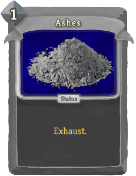 |  | Special | Status | 1 | Exhaust. |
| Affliction | 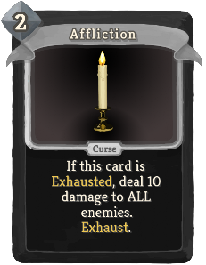 |  | Curse | Curse | 2 | If this card is Exhausted, deal 10 damage to ALL enemies. Exhaust. |
| Foggy Mind | 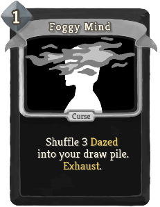 |  | Curse | Curse | 1 | Shuffle 3 Dazed into your draw pile. Exhaust. |
| Infected | 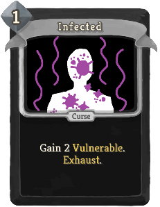 |  | Curse | Curse | 1 | Gain 2 Vulnerable. Exhaust. |
| Petrified | 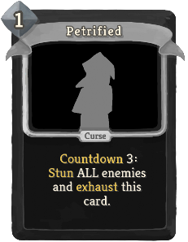 |  | Curse | Curse | 1 | Countdown 3: Stun ALL enemies and exhaust this card. |
| Defend | 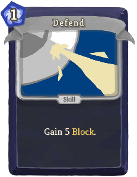 | 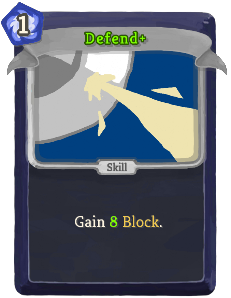 | Basic | Skill | 1 | Gain 5(8) Block. |
| Ill Will | 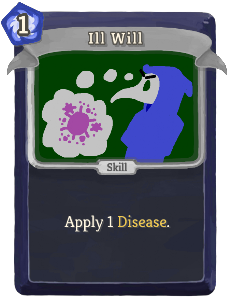 | 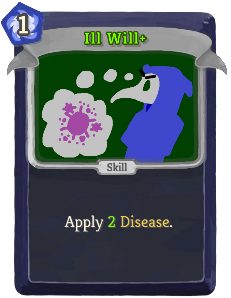 | Basic | Skill | 1 | Apply 1(2) Disease. |
| Strike | 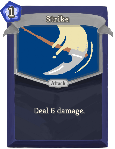 |  | Basic | Attack | 1 | Deal 6(9) damage. |
| Bad Memories | 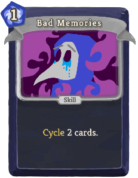 | 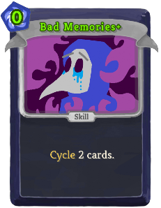 | Common | Skill | 1(0) | Cycle 2 cards.  |
| Boundless Greed | 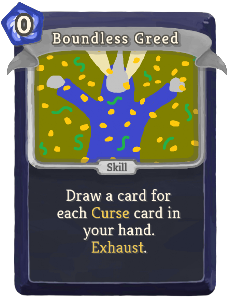 | 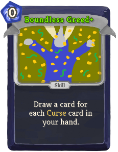 | Common | Skill | 0 | Draw a card for each Curse card in your hand. Exhaust. (not Exhaust.) |
| Break the Chains |  | 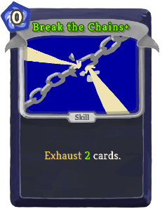 | Common | Skill | 0 | Exhaust 1(2) card(s). |
| Burden of Sin | 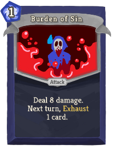 | 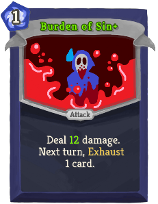 | Common | Attack | 1 | Deal 8(12) damage. Next turn, Exhaust 1 card. |
| Cursed Buckler | 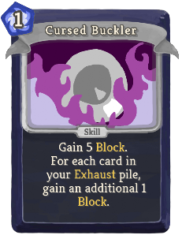 | 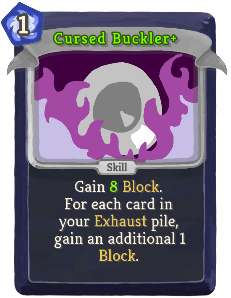 | Common | Skill | 1 | Gain 5(8) Block. For each card in your Exhaust pile, gain an additional 1 Block. |
| Exorcism |  | 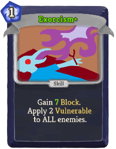 | Common | Skill | 1 | Gain 4(7) Block. Apply 2 Vulnerable to ALL enemies. |
| Lantern Flame | 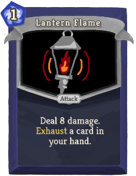 | 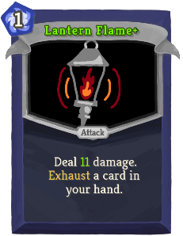 | Common | Attack | 1 | Deal 8(11) damage. Exhaust a card in your hand. |
| Malice | 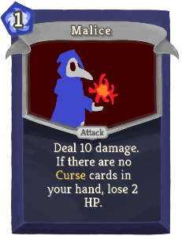 | 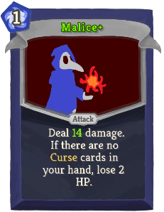 | Common | Attack | 1 | Deal 10(14) damage. If there are no Curse cards in your hand, lose 2 HP. |
| Memento Mori | 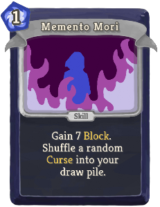 | 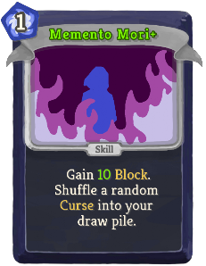 | Common | Skill | 1 | Gain 7(10) Block. Shuffle a random Curse into your draw pile. |
| Repent | 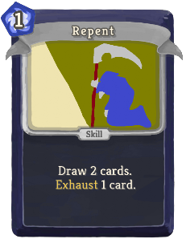 | 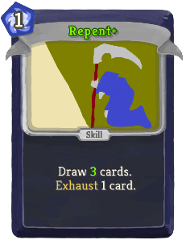 | Common | Skill | 1 | Draw 2(3) cards. Exhaust 1 card. |
| Resurrection |  | 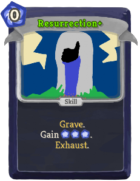 | Common | Skill | 0 | Grave. Gain [E] [E] ([E]). Exhaust. |
| Retaliate | 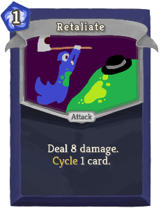 |  | Common | Attack | 1 | Deal 8(10) damage. Cycle 1 card.  |
| Sacrilege |  | 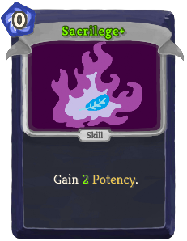 | Common | Skill | 0 | Gain 1(2) Potency. |
| Scatter Ashes | 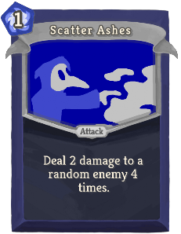 | 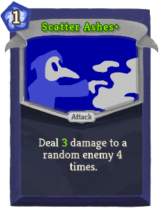 | Common | Attack | 1 | Deal 2(3) damage to a random enemy 4 times. |
| Shackle Guard | 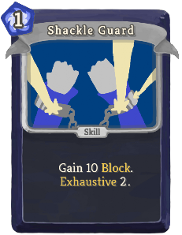 | 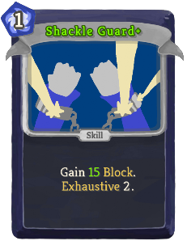 | Common | Skill | 1 | Gain 10(15) Block. Exhaustive !stslib:ex!. |
| Sickness | 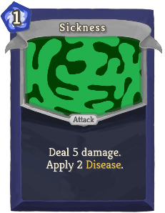 | 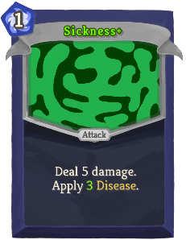 | Common | Attack | 1 | Deal 5 damage. Apply 2(3) Disease. |
| Soul Spear |  | 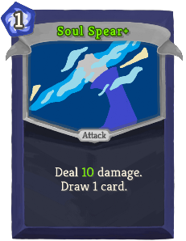 | Common | Attack | 1 | Deal 7(10) damage. Draw 1 card. |
| Unchained | 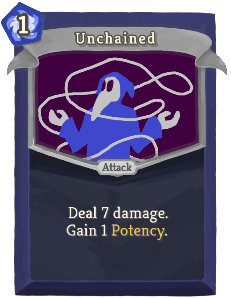 | 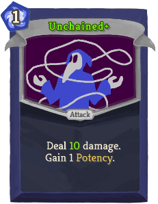 | Common | Attack | 1 | Deal 7(10) damage. Gain 1 Potency. |
| Vulgarity | 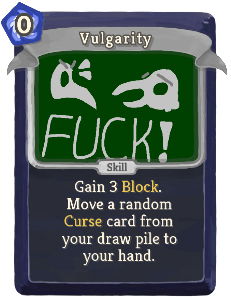 | 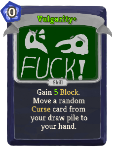 | Common | Skill | 0 | Gain 3(5) Block. Move a random Curse card from your draw pile to your hand. |
| Will-O-Wisp | 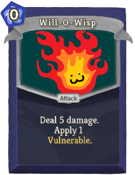 | 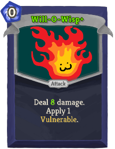 | Common | Attack | 0 | Deal 5(8) damage. Apply 1 Vulnerable. |
| Afflicted Weapon | 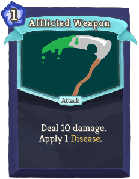 | 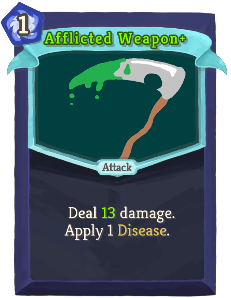 | Uncommon | Attack | 1 | Deal 10(13) damage. Apply 1 Disease. |
| Bacterial Culture | 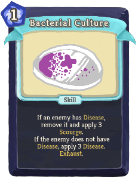 | 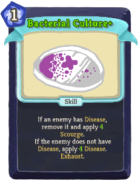 | Uncommon | Skill | 1 | If an enemy has Disease, remove it and apply 3(4) Scourge. If the enemy does not have Disease, apply 3(4) Disease. Exhaust. |
| Barbed Fist | 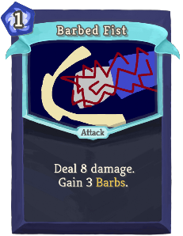 | 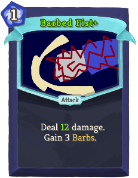 | Uncommon | Attack | 1 | Deal 8(12) damage. Gain 3 Barbs. |
| Barbed Parry |  |  | Uncommon | Skill | 1 | Gain 6 Block. If the enemy intends to attack, gain 5(13) Barbs. |
| Behead |  |  | Uncommon | Attack | 2 | Deal 14(17) damage. Apply 4 Vulnerable. |
| Beneath the Mask |  |  | Uncommon | Skill | 1 | Shuffle 3(4) Curse cards into your draw pile. Exhaust. |
| Blood Thinning |  |  | Uncommon | Power | 2(1) | At the start of your turn, Exhaust 1 card. |
| Cataclysm |  |  | Uncommon | Skill | 1 | Gain 4(5) Potency. |
| Cleanse |  |  | Uncommon | Power | 2(1) | If you draw a Curse, draw a card. |
| Cloud of Dust |  |  | Uncommon | Skill | 1(0) | This turn, when a card is drawn, Exhaust it and deal 8 damage to a random enemy. |
| Combo |  |  | Uncommon | Attack | 1 | Deal 9(11) damage. Countdown 2: Gain 1 Strength. |
| Contagion |  |  | Uncommon | Skill | 1 | Apply 2(3) Disease. When the enemy dies, apply 3 Disease to ALL enemies. |
| Cremate |  |  | Uncommon | Attack | 1 | Deal 18(22) damage. Shuffle 3 Ashes into your draw pile. |
| Dark Bead |  |  | Uncommon | Attack | 2 | Ethereal. Deal 25(30) damage. If there are no Curse cards in your hand, lose 6 HP. |
| False Diagnosis |  |  | Uncommon | Skill | 1 | If the enemy has Disease, apply 3(4) Disease. |
| Famous Technique |  |  | Uncommon | Skill | 1 | Gain 6(9) Block. If you have at least 3 cards in your Exhaust pile, draw 1(2) card(s). |
| Hold the Fort |  |  | Uncommon | Skill | 1 | Gain 30(35) Block. Solitary: This card gives 1 less Block. |
| Hysteria |  |  | Uncommon | Skill | 1 | Apply 1(2) Weak and Vulnerable to a random enemy 3 times. Exhaust. |
| Induce Trauma |  |  | Uncommon | Attack | 1 | Deal 30(35) damage. Solitary: This card deals 1 less damage. |
| Lord of the Flies |  |  | Uncommon | Power | 2(1) | Enemies take 25% more damage from Disease and Scourge. |
| Malice Soul |  |  | Uncommon | Power | 2(1) | The next 3 times you are attacked, add a random Curse card to your draw pile. |
| Mental Fortitude |  |  | Uncommon | Skill | 1 | Gain 5(8) Block. If you have no debuffs applied, gain an additional 5 Block. |
| Myriad of Curses |  |  | Uncommon | Attack | 1 | Deal 5 damage. For every card in your Exhaust pile, deal an additional 1(2) damage. |
| Penitence |  |  | Uncommon | Power | 2(1) | When you Exhaust a card, gain 5 Block. |
| Pestilence |  |  | Uncommon | Power | 2(1) | At the start of your turn, apply 1 Disease to ALL enemies. |
| Plague |  |  | Uncommon | Power | 2(1) | When you apply Disease or Scourge to an enemy, deal 6 damage to a random enemy. |
| Profaned Flame |  |  | Uncommon | Attack | 2 | Deal 11(15) damage and apply 3 Disease to each enemy if they do not have any Disease. |
| Projectile Purge |  |  | Uncommon | Attack | 1 | Deal 3(4) damage 3 times. Apply 1 Disease. |
| Purge Disease |  |  | Uncommon | Attack | 1 | Deal 10(14) damage. If the enemy has Disease, deal an additional 6(9) damage. |
| Raise Hell |  |  | Uncommon | Attack | 2 | For all Curse cards in play, deal 4(6) damage to a random enemy. |
| Reading |  |  | Uncommon | Skill | 1 | Ethereal. Draw a card. If the drawn card is a Curse, gain 3 Strength. Exhaust. (not Exhaust.) |
| Rise! |  |  | Uncommon | Skill | 1 | Move 2(3) cards from your discard pile to the top of your draw pile. |
| Risk Taker |  |  | Uncommon | Skill | 1 | Increase an enemy's Strength by 1(2). Gain 1(2) Dexterity. Exhaust. |
| Sacrificial Rite |  |  | Uncommon | Skill | 2(1) | Exhaust a card. Gain 1 Strength. Exhaustive !stslib:ex!. |
| Second Chance |  |  | Uncommon | Skill | 1 | Innate. Ethereal. (not Ethereal.) Exhaust your hand. Draw a card for each card Exhausted. |
| Spite |  |  | Uncommon | Attack | 0 | Deal 5(7) damage. If this card does not kill an enemy, return it to your hand and increase it's cost by 1 for this turn. |
| Taunt |  |  | Uncommon | Skill | 1 | If the enemy intends to attack, Gain 16(20) Block and Increase the enemy's Strength by 8 for this turn. |
| Wipeout |  |  | Uncommon | Skill | 2(1) | Exhaust your hand. For every 2 cards exhausted, gain 1 Dexterity. Exhaust. |
| Burning Dread |  |  | Rare | Skill | 2(1) | Exhaust your hand. Gain 1 Strength for each Attack Exhausted. Gain 1 Dexterity for each Skill Exhausted. Deal 8 damage to ALL enemies for all other cards Exhausted. Exhaust. |
| Conjure the Damned |  |  | Rare | Skill | 2(1) | Draw Curse cards from your discard and draw piles until your hand is full. Exhaust. |
| Dark Form |  |  | Rare | Power | 3 | At the start of your turn, gain 3(5) Potency. |
| End of the World |  |  | Rare | Skill | X | Gain 2(3) Potency X times. Exhaust. |
| Great Seal |  |  | Rare | Power | 3(2) | When you Exhaust a card, gain 1 Potency for the rest of combat. |
| Highway to Hell |  |  | Rare | Skill | 2 | Apply 8(13) Scourge. Exhaust. |
| Miasma |  |  | Rare | Attack | 2 | Deal 3(5) damage to a random enemy for each card in the exhaust pile. (Includes this card.) Exhaust. |
| Monkey's Paw |  |  | Rare | Skill | 0 | Cycle your hand. Countdown 2(3): This card becomes a unique Curse for the rest of combat. |
| Morbid Fascination |  |  | Rare | Attack | 2 | Deal 7(14) damage and apply 99 Vulnerable to ALL enemies. Exhaust. |
| Surgical Precision |  |  | Rare | Attack | 5(4) | Deal an obscene amount of damage. Fleeting. |
| The Cure |  |  | Rare | Attack | 3 | If the enemy has at least 25(20) Disease and Scourge, deal 100 damage. Exhaust.  |
| The Ultimate Sacrifice |  |  | Rare | Skill | 0 | Lose 6(10) HP. Gain Strength equal to half of the HP lost. Exhaust. |

## Potions

| Image | Name | Rarity | Description |
| ----- | ---- | ------ | ----------- |

## Relics

| Image | Name | Rarity | Color | Description | Flavor |
| ----- | ---- | ------ | ----- | ----------- | ------ |
|  | Black Diamond | Starter | Wordo_mod_color | Every 3 combats, choose a Curse card to add to your deck. Can be skipped. | A jet black gem, paradoxically as fragile as the soul. |
|  | Incandescent Pearl | Starter | Wordo_mod_color | At the start of each combat, gain #yJudgement. | A perfectly smooth pearl. It's as if light stays trapped inside of it. |
|  | Gas Mask | Rare | Red | When you #yExhaust a card, add 1 point to the counter. When you enter a boss combat, heal that much. | Filter out the dust. |

| Image | Name |
| ----- | ---- |
|  | The Judge |

